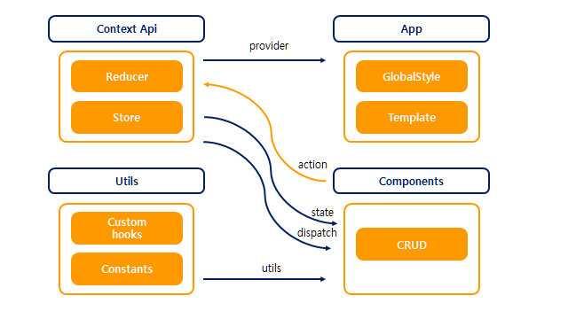
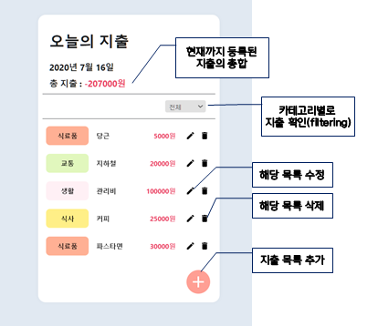

# react-financial-ledger

# 지출기입장🔖
> `react hooks` 에 대한 **이해**를 높이기 위해 다양한 기능 구현 보다 **컴포넌트 분리, 데이터 전역관리 및 최적화**를 위한 `hooks` 활용에 더욱 초점을 맞췄다.
 

-----
 

## 목적
  1. `React hooks` 에 대한 이해를 높인다.
  2. `styled-components` 에 대한 이해를 높인다.
  3. `contextAPI` 와 `useReducer` 로 상태를 관리한다.
 

## 아키텍쳐
  - `Context Api`: createContext와 useReducer 를 활용해 context api에서 state와 dispatch를 각각 내보냄
  - `Utils`: 공통적으로 사용하는 로직 분리
  - `Components`: state 상태를 변경하는 action 보냄

 

## 기능
  - 지출 내역을 등록, 수정, 삭제, 조회 할 수 있다.
  - 카테고리별로 지출 내역을 조회할 수 있다.
 

## 결과물
<영상보기> 
🔔🔔🔔 [financial-ledger]: (//tv.kakao.com/v/410779334)
 

<사진> 

 

## 구동방법
1. `git clone` https://github.com/BoMeeYoon/react-hooks-financial-ledger.git
2. `npm init` 
3. `yarn start`
